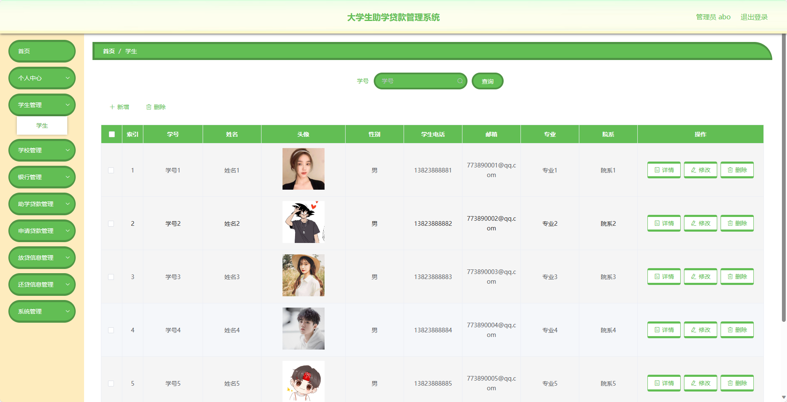
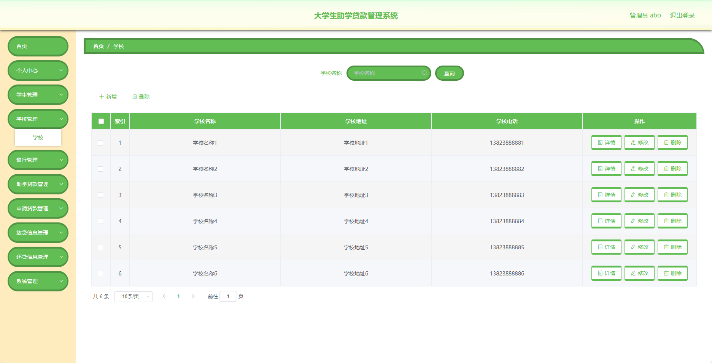
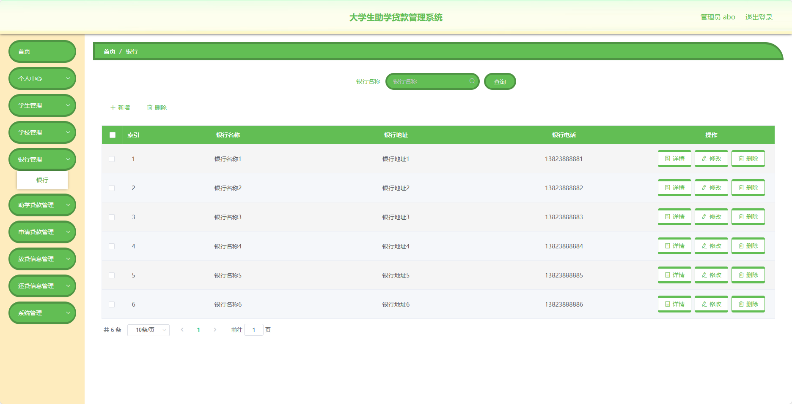
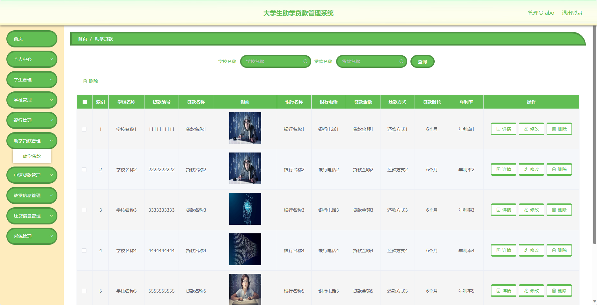
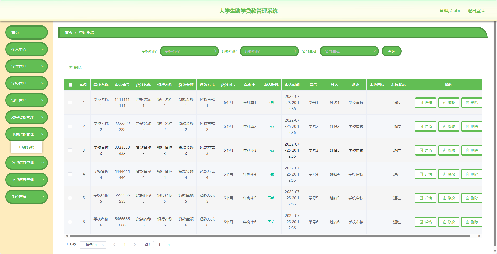
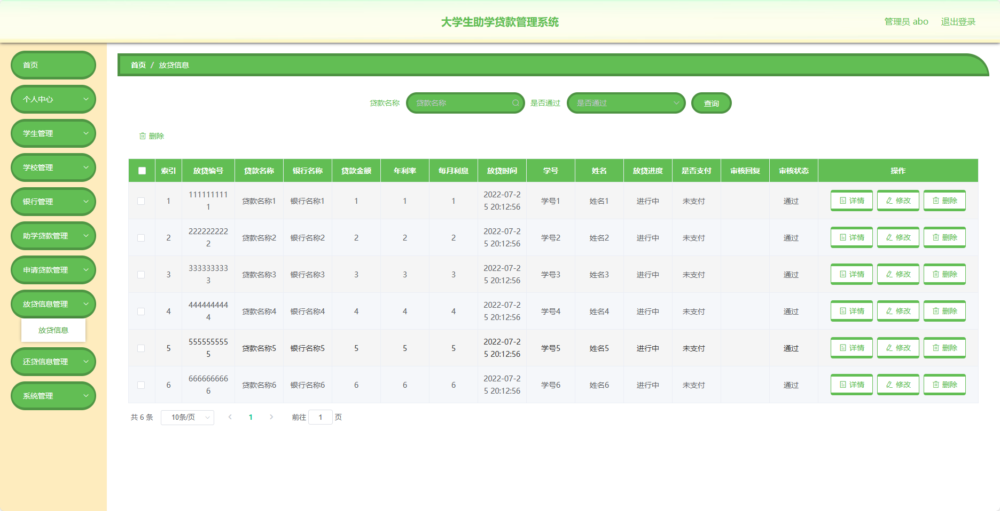
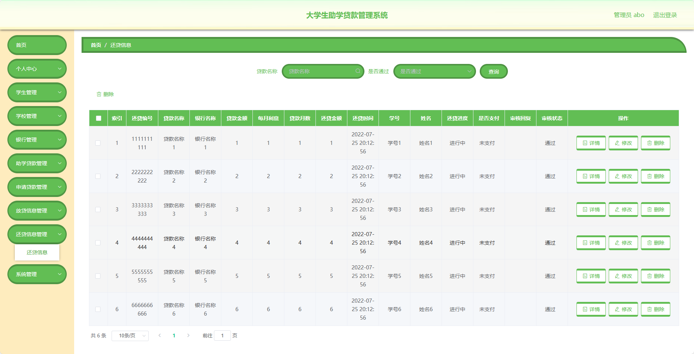
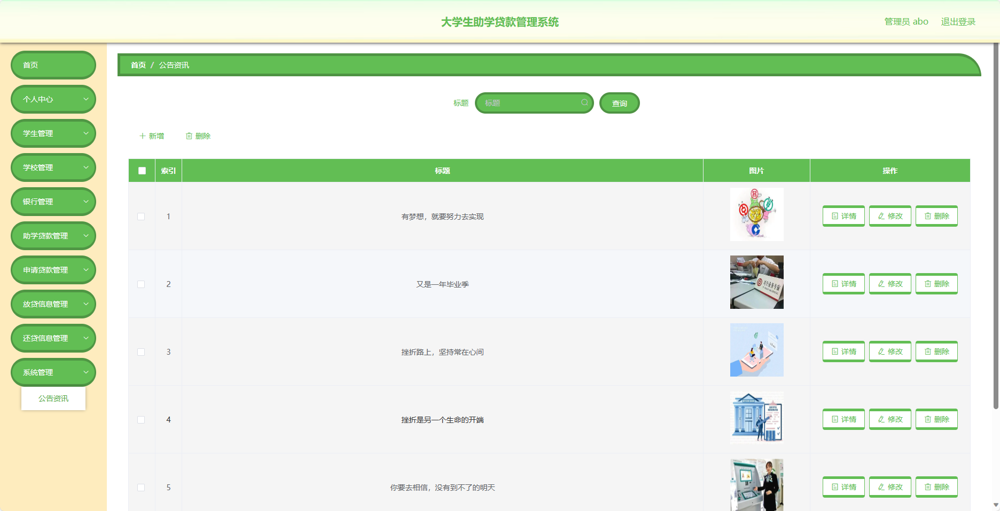
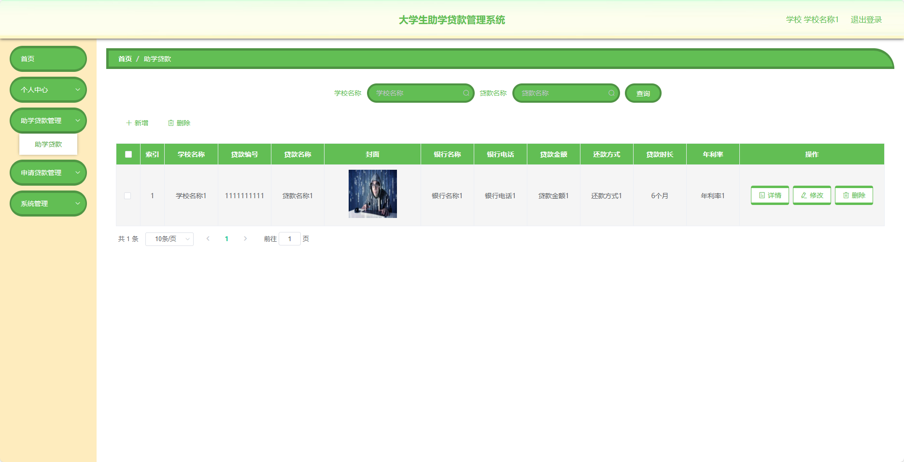

## 基于SpringBoot的大学生助学贷款管理系统

###  获取sql数据库文件: 从戎源码网 (https://armycodes.com/) QQ: 386869957 QQ群: 377586148
###  所有系统地址: (https://github.com/YuLin-Coder/AllProjectCatalog) 
###  所有项目以及源代码本人均调试运行无问题 可支持远程安装部署调试、定制修改、代码讲解

## 项目介绍
基于SpringBoot的大学生助学贷款管理系统，系统包含两种角色：管理员、用户，主要功能如下。

### 【管理员】:
1. 个人中心：管理员可以管理个人信息。
2. 学生管理：管理员可以管理学生信息，包括添加、编辑、删除等操作。
3. 学校管理：管理员可以管理学校信息，包括添加、编辑、删除等操作。
4. 银行管理：管理员可以管理银行信息，包括添加、编辑、删除等操作。
5. 助学贷款管理：管理员可以管理助学贷款信息，包括添加、编辑、删除等操作。
6. 申请贷款管理：管理员可以查看和管理贷款申请，包括审批、驳回等操作。
7. 放贷信息管理：管理员可以管理已放贷的信息，包括添加、编辑、删除等操作。
8. 还贷信息管理：管理员可以管理还贷信息，包括添加、编辑、删除等操作。
9. 系统管理：管理员可以管理系统的基础数据和配置，包括用户信息、权限管理等。

### 【学校】:
1. 个人中心：学校可以管理个人信息。
2. 助学贷款管理：学校可以管理助学贷款的信息，包括添加、编辑、删除等操作。
3. 申请贷款管理：学校可以查看和管理贷款申请，包括审批、驳回等操作。
4. 系统管理：学校可以管理系统的基础数据和配置，包括用户信息、权限管理等。

### 【学生】:
1. 个人中心：学生可以管理个人信息。
2. 助学贷款管理：学生可以查看助学贷款的信息。
3. 申请贷款管理：学生可以进行贷款申请，包括填写申请信息等操作。
4. 放贷信息管理：学生可以查看已放贷的信息。
5. 还贷信息管理：学生可以管理还贷信息，包括填写还贷金额、还贷时间等操作。
6. 系统管理：学生可以管理个人密码等信息。

### 银行：
1. 个人中心：银行可以管理个人信息。
2. 助学贷款管理：银行可以管理助学贷款的信息，包括添加、编辑、删除等操作。
3. 申请贷款管理：银行可以查看和管理贷款申请，包括审批、驳回等操作。
4. 放贷信息管理：银行可以管理已放贷的信息，包括添加、编辑、删除等操作。
5. 还贷信息管理：银行可以管理还贷信息，包括添加、编辑、删除等操作。
6. 系统管理：银行可以管理系统的基础数据和配置，包括用户信息、权限管理等。

## 项目技术
- 编程语言：Java
- 数据库：MySQL
- 项目管理工具：Maven
- 前端技术：HTML、CSS、JavaScript、Jquery、Vue
- 后端技术：Spring、SpringMVC、MyBatis

## 运行环境
- JDK版本：JDK1.8及以上
- 开发工具：IDEA、Ecplise、Myecplise都可以
- 数据库: MySQL5.7及以上
- Maven：maven3.0及以上
- Node：14.14.0及以上

## 运行截图

